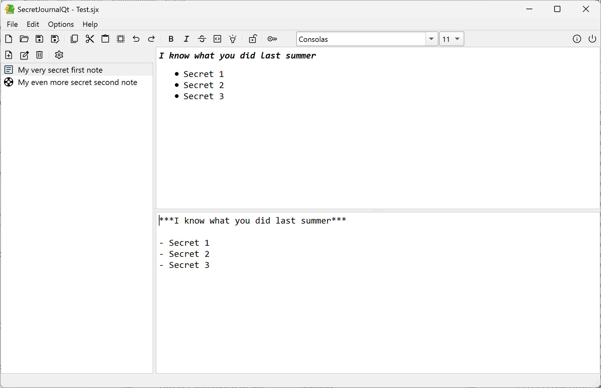

# SecretJournalQt
**SecretJournalQt** is a lightweight, cross‑platform encrypted journal application built with Qt6.
It shares some of the core functionality and code base of **SimpleJournalQt**, but adds a robust cryptographic layer to protect all journal entries and *does not include the Markdown feature* available in SimpleJournal.
The project is designed for users who want a minimal, distraction‑free writing experience while ensuring that their personal notes remain confidential.

🔐 **Key Features**
- Clean and simple Qt‑based user interface
- Transparent encryption and decryption of journal files
- Modern cryptographic primitives:
	- Twofish (symmetric encryption)
	- HMAC (integrity protection)
	- PBKDF2 (password‑based key derivation)
- After encryption, the binary ciphertext is encoded using Base64 to ensure safe and consistent file handling across platforms and tools. This avoids issues with raw binary data and makes journal files easier to store, transfer, and inspect when necessary.

🧩 **Cryptography Overview**
SecretJournalQt uses a layered security approach:
- PBKDF2 derives strong keys from user passwords
- Twofish encrypts all journal content
- HMAC ensures that files cannot be tampered with undetected. 

All cryptographic routines are validated against official test vectors at application startup.

⚠️ **Endianness Notice (Important)**
SecretJournalQt currently stores all 32‑bit integer fields using the native endianness of the host system.
- On little‑endian systems (x86, x64, ARM64), files are written in little‑endian format
- On big‑endian systems, files are written in big‑endian format. As a result:
❌ Files are not cross‑endian compatible. A journal created on a little‑endian machine cannot be opened on a big‑endian machine, and vice versa.

Given that the primary target platforms are Windows and macOS - both universally little‑endian - introducing additional complexity for cross‑endian compatibility would provide no practical benefit. For this reason, the current design intentionally avoids extra abstraction layers or conversion logic.

#### Updates
**2026-04-09:**
- macOS only: Added a splitter handle stylesheet to reduce handle width

**2026-04-12:**
- Added a dropdown list to insert bullets into the text

**2026-04-13:**
- New option to insert tab before bullet
